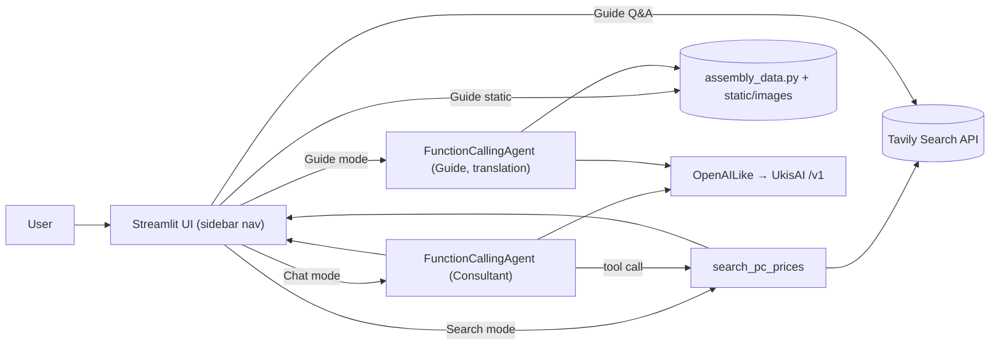

# PC AI Component Assistant

A Streamlit-based assistant that helps you research PC component prices, design budget-balanced builds with an AI consultant, and follow a step-by-step assembly guide.

The AI is powered by [LlamaIndex](https://www.llamaindex.ai/) with a `FunctionCallingAgent` that talks to the [UkisAI](https://api.ukisai.academy/) OpenAI-compatible endpoint. Live market listings and guide snippets use the [Tavily](https://tavily.com/) Search API (`search_pc_prices`, `search_guide_answer`, `search_step_illustration` in `src/tools/price_search.py`).

## Features

- **Search** — look up a component and see live listings (Tavily-backed) in a card grid with thumbnail, name, price, store, and a *Buy Now* link. Region-aware queries use `src/data/regions.json`.
- **Chat (Build Consultant)** — describe your budget and use case; the agent proposes a balanced parts list and calls `search_pc_prices` for real listings per part.
- **Assembly Guide** — numbered walkthrough loaded from `src/data/assembly_data.py` with **local images** under `src/static/images/`. Choose **English** or **Serbian**; English uses the guide agent to translate titles and body text on the fly (cached in the session). Follow-up questions use Tavily for live answers and optional remote illustrations.

## Project layout

```text
.
├── app.py                       # Streamlit entry point
├── requirements.txt
├── .env.example                 # copy to .env
├── .streamlit/
│   └── config.toml              # default theme (dark); user can override in UI settings
└── src/
    ├── config.py                # env-based settings (never log full API keys)
    ├── llm.py                   # UkisAI OpenAILike + GET /models discovery
    ├── prompts.py               # consultant + assembly guide system prompts
    ├── agent.py                 # FunctionCallingAgent factories
    ├── tools/price_search.py    # Tavily live search + guide helpers
    ├── data/
    │   ├── assembly_data.py     # static assembly steps + image paths
    │   ├── regions.json         # retailer domain hints per region
    │   └── mock_catalog.json    # legacy sample data (not primary search path)
    ├── static/
    │   └── images/              # local assembly guide assets (tracked in git)
    └── ui/                      # Streamlit views
        ├── sidebar.py
        ├── sanitize.py          # basic chat/script-tag stripping for inputs
        ├── components.py        # shared product card / grid
        ├── search_view.py
        ├── chat_view.py
        └── guide_view.py
```

## Setup

Requires Python 3.10+.

```bash
python -m venv .venv
# Windows PowerShell
.venv\Scripts\Activate.ps1
# macOS / Linux
source .venv/bin/activate

pip install -r requirements.txt

cp .env.example .env   # then edit if needed
```

`.env` variables:

| Variable           | Required | Description                                                                 |
| ------------------ | -------- | --------------------------------------------------------------------------- |
| `UKISAI_API_BASE`  | yes      | Base URL of the UkisAI OpenAI-compatible API (e.g. `https://api.ukisai.academy/v1`). |
| `UKISAI_API_KEY`   | yes      | API key. Use `dummy` if the endpoint does not enforce authentication.       |
| `UKISAI_MODEL`     | no       | Force a specific model id and skip auto-discovery via `GET /models`.      |
| `TAVILY_API_KEY`   | yes      | Tavily API key for live price search and guide snippets.                    |

Secrets are read only from environment variables (via `os.getenv` after optional `load_dotenv` for local `.env`). Use `src.config.redact_secret` if you ever need to log that a key is present without logging the full value.

## Run

```bash
streamlit run app.py
```

Then open the printed URL (typically `http://localhost:8501`) in your browser.

### Smoke-test the LLM connection only

```bash
python -m src.llm
```

This resolves a model from `GET /models` (or your `UKISAI_MODEL` override) and runs a one-line completion.

### Smoke-test the price tool only

```bash
python -m src.tools.price_search
```

Prints sample search results for a few common queries.

## Architecture



## Troubleshooting

- **`ConfigError: UKISAI_API_BASE is not set`** — copy `.env.example` to `.env` in the project root.
- **`Could not discover a model from .../models`** — set `UKISAI_MODEL` in `.env` to bypass discovery, or check that the endpoint is reachable from your machine.
- **Tool calls never fire in Chat mode** — make sure the resolved model supports OpenAI-style function calling. The `is_function_calling_model=True` flag is already set on `OpenAILike`.
- **`TAVILY_API_KEY is not set`** — add your Tavily key to `.env` (see `.env.example`).
