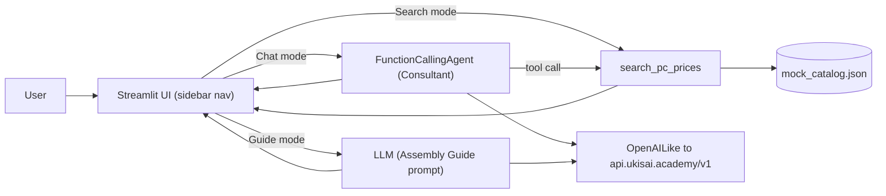

# PC AI Component Assistant

A Streamlit-based assistant that helps you research PC component prices, design budget-balanced builds with an AI consultant, and follow a step-by-step assembly guide.

The AI is powered by [LlamaIndex](https://www.llamaindex.ai/) with a `FunctionCallingAgent` that talks to the [UkisAI](https://api.ukisai.academy/) OpenAI-compatible endpoint and can call a custom market-search tool.

## Features

- **Search** — direct component look-up against a mock market catalog. Returns a 3-column card grid with thumbnail, name, price, store, and a *Buy Now* link.
- **Chat (Build Consultant)** — describe your budget and use case, the agent proposes a balanced parts list and automatically pulls live listings for each part via the search tool.
- **Assembly Guide** — a numbered, beginner-friendly walkthrough for building a desktop PC, with image placeholders per step. Ask follow-up questions about specific parts.

## Project layout

```text
.
├── app.py                       # Streamlit entry point
├── requirements.txt
├── .env.example                 # copy to .env
└── src/
    ├── config.py                # loads .env via python-dotenv
    ├── llm.py                   # UkisAI OpenAILike + GET /models discovery
    ├── prompts.py               # consultant + assembly guide system prompts
    ├── agent.py                 # FunctionCallingAgent factories
    ├── tools/price_search.py    # search_pc_prices FunctionTool (mock-backed)
    ├── data/mock_catalog.json   # mock product catalog
    └── ui/                      # Streamlit views
        ├── sidebar.py
        ├── components.py        # shared product card / grid
        ├── search_view.py
        ├── chat_view.py
        └── guide_view.py
```

## Setup

Requires Python 3.10+.

```bash
python -m venv .venv
# Windows PowerShell
.venv\Scripts\Activate.ps1
# macOS / Linux
source .venv/bin/activate

pip install -r requirements.txt

cp .env.example .env   # then edit if needed
```

`.env` variables:

| Variable           | Required | Description                                                                   |
| ------------------ | -------- | ----------------------------------------------------------------------------- |
| `UKISAI_API_BASE`  | yes      | Base URL of the UkisAI OpenAI-compatible API (default `https://api.ukisai.academy/v1`). |
| `UKISAI_API_KEY`   | yes      | API key. Use `dummy` if the endpoint does not enforce authentication.         |
| `UKISAI_MODEL`     | no       | Force a specific model id and skip auto-discovery via `GET /models`.          |

Nothing is hardcoded — all configuration flows through `src/config.py`.

## Run

```bash
streamlit run app.py
```

Then open the printed URL (typically `http://localhost:8501`) in your browser.

### Smoke-test the LLM connection only

```bash
python -m src.llm
```

This resolves a model from `GET /models` (or your `UKISAI_MODEL` override) and runs a one-line completion.

### Smoke-test the price tool only

```bash
python -m src.tools.price_search
```

Prints sample search results for a few common queries.

## Swapping the mock catalog for a real data source

The mock catalog lives in `src/data/mock_catalog.json` and is loaded by `src/tools/price_search.py`. To wire in a real source:

1. Replace the body of `search_pc_prices` in `src/tools/price_search.py` with a call to your search API or scraper (SerpAPI, Tavily, Brave Search, a store-specific scraper, etc.). Keep the return shape identical: a list of dicts with `name`, `category`, `price_eur`, `store`, `url`, `thumbnail`.
2. Add any new credentials to `.env.example` and `.env`, and read them via `src/config.py`.
3. Nothing else needs to change — the agent, UI, and card components consume the tool's output unchanged.

## Architecture



## Troubleshooting

- **`ConfigError: UKISAI_API_BASE is not set`** — copy `.env.example` to `.env` in the project root.
- **`Could not discover a model from .../models`** — set `UKISAI_MODEL` in `.env` to bypass discovery, or check that the endpoint is reachable from your machine.
- **Tool calls never fire in Chat mode** — make sure the resolved model supports OpenAI-style function calling. The `is_function_calling_model=True` flag is already set on `OpenAILike`.
